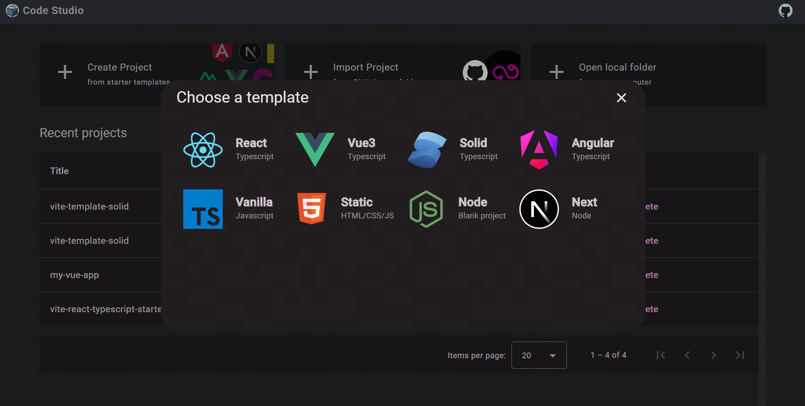
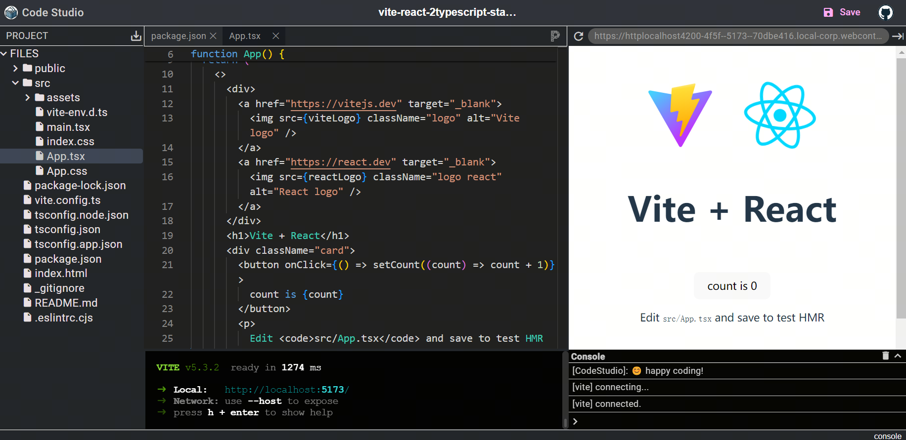

<p align="center">
  <a href="#">
    
  </a>
</p>

<h1 align="center">Code Studio</h1>
<h3 align="center">Web Code Runner for JS and NodeJS</h3>

## Features

- [x] Create projects from existing templates (10+ templates included) without cloning or installing anything locally
- [x] Support import from [GitHub folder](https://code-studio.chenxiaoyao.cn/edit?source=https://github.com/chenxiaoyao6228/fe-notes/tree/main/React%E7%9B%B8%E5%85%B3/_demo/react-starter) or local folder
- [x] Sync your project to Gist (if GitHub token is provided) or download as ZIP
- [x] File Manager: easily create, edit, remove files and folders, with drag and drop support
- [x] Basic code editing abilities: path IntelliSense, go to definition, etc.
- [x] Integrated Console: no need to press 'F12' to open DevTools
- [x] Prettier as the default code formatter
- [x] Keyboard shortcuts: long press 'CTRL' ('CMD' on Mac) to show the shortcut list
- [ ] Various VSCode theme support
- [ ] File Sharing
- [ ] Diff editor

You can experience code-studio through [this link](https://code-studio.chenxiaoyao.cn)

## Screenshots





## Development

Code Studio uses the following tech stack:

> Angular 18 + RxJS + WebContainers + Monaco Editor + XtermJS

Run the following commands to get started:

```sh
yarn install
yarn start
```

## Contribute

For anyone interested in the project, any kind of contribution is greatly appreciated.

## Reference

- https://webcontainers.io
- https://microsoft.github.io/monaco-editor/
- https://angular.dev/
- https://material.angular.io/
- https://github.com/xtermjs/xterm.js

Great thanks to these awesome open-source projects!
