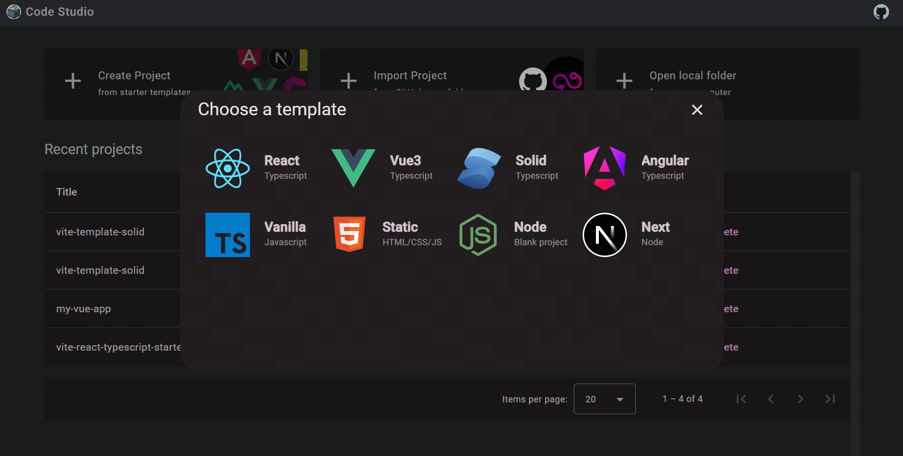
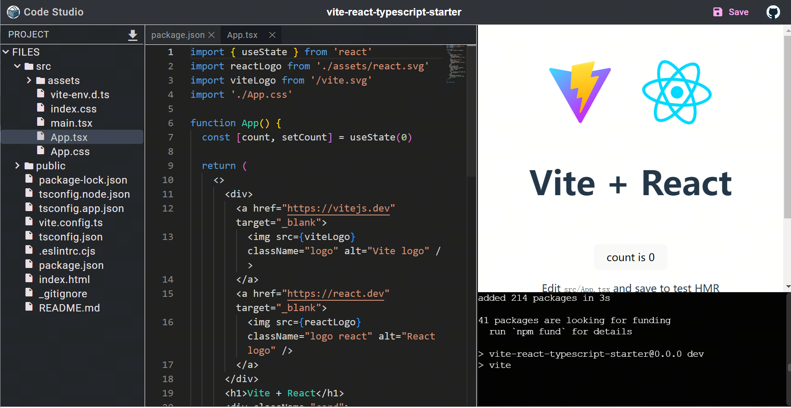

<p align="center">
  <a href="#">
    
  </a>
</p>

<h1 align="center">Code Studio</h1>
<h3 align="center">Web code runner for JS and NodeJS</h3>

## Features

- Create project from existing templates, [github folder](<(https://code-studio.chenxiaoyao.cn/edit?terminal=dev&source=https://github.com/chenxiaoyao6228/fe-notes/tree/main/Editor/_demo/webcontainers-express-app)>) or local folder
- Sync your project to Gist (if github token is provided)

## Screenshots





## Development

code studio use the following technologies:

> Angular18 + RxJS + WebContainers + Monaco Editor + Xterm

```sh
yarn install
yarn start
```

## Reference

- https://webcontainers.io
- https://microsoft.github.io/monaco-editor/
- https://github.com/xtermjs/xterm.js
- https://angular.dev/
- https://material.angular.io/
